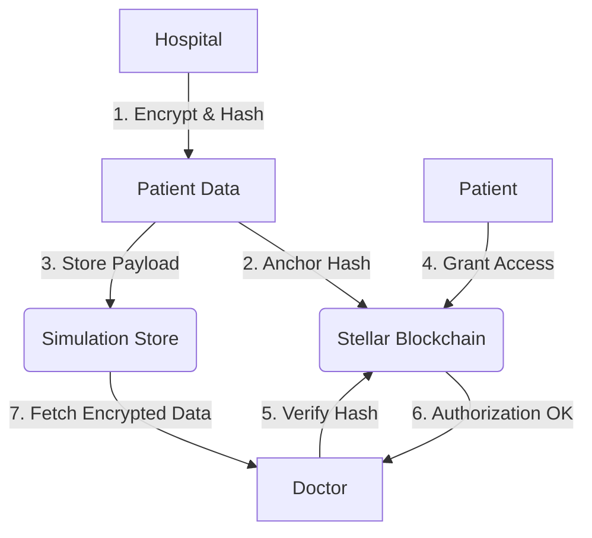

# MediLedger: Stellar-Powered Bio-Data Vault 🏥 🔒

### Decentralized Medical Record Management & Verification System

[](https://stellar.org)
[](https://soroban.stellar.org)
[](https://react.dev)
[](https://www.typescriptlang.org/)
[](https://tailwindcss.com/)

---

## 🎓 Overview
**MediLedger** is a high-security, patient-centric ecosystem designed to solve the challenges of fragmented healthcare data. By leveraging the **Stellar Blockchain** and **Soroban Smart Contracts**, it ensures that medical records are immutable, easily verifiable, and strictly controlled by the patient. 

### 🔄 System Data Flow


### 📋 System Details
| Category | Details |
| --- | --- |
| **System Name** | MediLedger: Decentralized Health Vault |
| **Blockchain** | Stellar (Soroban Smart Contracts) |
| **Network** | Futurenet / Testnet Simulation |
| **Primary Goal** | Patient Sovereignty & Data Integrity |

---

## 🏗️ Architecture

### Technology Stack

#### 🌐 Frontend Service
* **React.js**: Single Page Application (SPA) framework for the user interface.
* **Tailwind CSS**: Utility-first CSS framework for custom, responsive design.
* **Framer Motion**: Production-ready motion library for animations.
* **Stellar SDK**: Client-side interaction with the Stellar Network and Wallets.

#### 🖥️ Backend Service
* **Node.js**: JavaScript runtime for building the scalable backend.
* **Express.js**: Web framework for building the REST API.
* **In-Memory Store**: Stateful prototype storage for rapid development.
* **TypeScript**: Type-safe development for robust backend logic.

#### ⛓️ Blockchain Service
* **Soroban SDK**: Smart contract development and anchored anchoring.
* **Stellar Horizon**: API for querying ledger state and transaction history.
* **Freighter API**: Secure browser-based signing for patient transactions.

### System Components
1. **Clinical Submitter**: Validates and encrypts raw medical data before ledger anchoring.
2. **Permission Ledger**: A decentralized registry of "Who has access to What" stored on Stellar.
3. **Audit Engine**: Tracks every access/query event into a chronological immutable log.

---

## 📁 Project Structure
The repository is organized to separate concerns between medical data handling, blockchain anchoring, and role-based UI presentation.

```text
├── src/
│   ├── pages/                   # Role-Based UI Views
│   │   ├── LoginPage.tsx        # Multi-role Entry Point
│   │   ├── PatientDashboard.tsx # Data Ownership & Permission Control
│   │   ├── DoctorDashboard.tsx  # Patient Repository & Clinical Viewer
│   │   └── HospitalDashboard.tsx # Data Submission & Ledger Indexing
│   ├── components/              # UI Architecture
│   │   ├── DemoGuide.tsx        # Tutorial Walkthrough
│   │   └── NotificationCenter.tsx # Real-time Ledger Events
│   ├── lib/                     # System Utilities
│   │   └── stellar.ts           # Soroban & Horizon Logic
│   ├── App.tsx                  # Routing Orchestration
│   ├── types.ts                 # Unified Interfaces
│   └── main.tsx                 # Entry Point
├── server.ts                    # Backend API & Prototype Store
├── contracts/                   # Soroban Smart Contracts (Rust)
├── README.md                    # Project Documentation
└── package.json                 # Dependencies
```

---

## 🚀 Getting Started

### 📋 Prerequisites
* **Node.js**: v18.x or higher
* **Wallet**: [Freighter Wallet](https://www.freighter.app/) (Recommended for Soroban interactions)
* **Browser**: Chrome/Edge/Brave for extension support

<<<<<<< HEAD
### 🛠️ Installation & Local Setup (Cloning)
To run this project locally, follow these steps:

1. **Clone the Repository**
=======
### 🛠️ Installation
1. **Clone the Project**
>>>>>>> e89a238ed4b19e69d8e955555ec3adde3ec2e808
   ```bash
   git clone https://github.com/your-username/mediledger-stellar-vault.git
   cd mediledger-stellar-vault
   ```
<<<<<<< HEAD

=======
>>>>>>> e89a238ed4b19e69d8e955555ec3adde3ec2e808
2. **Install Dependencies**
   ```bash
   npm install
   ```
<<<<<<< HEAD

3. **Set Environment Variables**
   Create a `.env` file for your Stellar configuration:
=======
3. **Set Environment Variables**
   Create a `.env` file for your Stellar Secret Keys:
>>>>>>> e89a238ed4b19e69d8e955555ec3adde3ec2e808
   ```bash
   cp .env.example .env
   ```

<<<<<<< HEAD
4. **Run Development Server**
   ```bash
   npm run dev
   ```
   The app will be available at `http://localhost:3000`.

---

## 📤 Manual GitHub Deployment
If you have exported this project and wish to push it to your own repository (e.g., `Decentralised-DNS` or `MediLedger`):

```bash
# Navigate to the project directory
# Navigate to the project directory
cd MediLedger-Stellar

# Initialize git (if not already)
git init

# Remove existing origin and add your new repository
git remote remove origin
git remote add origin https://github.com/21vidya/MediLedger-Stellar.git

# Stage and commit changes
git add .
git commit -m "Initial commit: MediLedger"

# Push to your repository
git push -u origin main
```
=======
### 🛰️ Running the Application
```bash
npm run dev
```
Open [http://localhost:3000](http://localhost:3000) to access the integrated portal.
>>>>>>> e89a238ed4b19e69d8e955555ec3adde3ec2e808

---

## 📋 Features

### Phase 1: Clinical Vault (Current)
* **Encryption on Submission**: All bio-data is encrypted client-side.
* **Soroban Anchoring**: Links record hashes to Patient Public Keys on-chain.
* **Fine-Grained Permissions**: Time-bound access grants for specific clinical categories.

### Phase 2: Interoperability & Scaling
* **Multi-Chain Bridge**: Support for Ethereum/Polygon verification.
* **AI Diagnostics**: Automated analysis for authorized doctors.
* **Mobile App**: Dedicated Android/iOS vault app.
* **Consent Revocation**: Instant recursive permission revocation via Soroban smart contracts.

---

## 🔐 Patient ID & Record Format
To maintain privacy, all records follow a standardized, secure format:
* **Patient Key**: `VAULT-XXXX-XXXX` (Derived from Public Key)
* **Record Hash**: SHA-256 anchor of encrypted contents stored on Stellar.
* **Permission Token**: Signed grant stored in the Soroban ACL.

---

## 📺 Project Demonstration
Below is an execution overview of the MediLedger system in action.

**[🚀 PROTOTYPE DEPLOYMENT](https://ais-pre-cn4cjnmphzobfxbao4mldi-235614555006.asia-southeast1.run.app)**

### Full System Walkthrough

> *Note: Record your screen using a tool like OBS or Loom, save it as a GIF, and replace this placeholder link.*

---

## 📊 Data Storage

### On-Chain (Stellar Blockchain)
* **Soroban Smart Contract**: Stores Access Control Lists (ACL).
* **Anchors**: Immutable record hashes and IPFS-style URIs.
* **Audit Logs**: Cryptographic signatures of access events.

### Off-Chain (Prototype Store)
* Encrypted Medical Documentation (EHR)
* Detailed Clinical History
* User Profiles

---

## ⛓️ Smart Contract Integration
The core business logic is defined on-chain in **Rust** using the **Soroban SDK**.

### Smart Contract Functions
* `anchor_record`: Registers a record's unique hash and URI.
* `update_permission`: Modifies the ACL based on patient intent.
* `has_access`: Verifies authorization before granting data views.

### Contract Technicals
* **Language**: Rust
* **Location**: `/contracts/mediledger/src/lib.rs`

---

## 🔒 Security Features
* **End-to-End Encryption**: Data is unreadable by the platform host.
* **Wallet Normalization**: Strict casing enforcement to prevent spoofing.
* **Zero-Trust Access**: No data is served without on-chain verification.

---

## 🛠️ Development

### API Endpoints
* `GET /api/health`: System health status.
* `POST /api/ledger/anchor`: Write to the simulation ledger.
* `POST /api/permissions`: Sync off-chain permissions.

---

## 📄 License
This project is licensed under the MIT License.


---

## 📞 Support
For support, please contact the development team at [support@mediledger.io].


